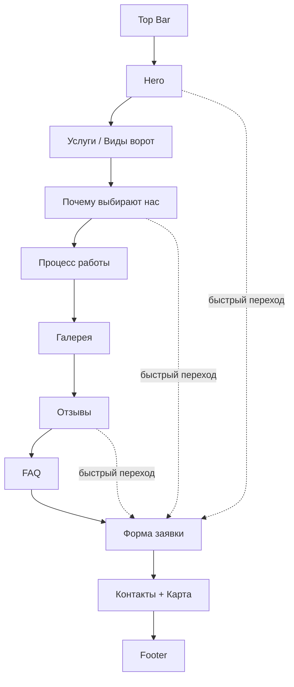

# SPEC.md — StalBruk (рабочее название)
### Лендинг по изготовлению и монтажу металлических ворот и металлоконструкций

**Версия:** 1.0 (MVP)
**Статус:** Draft для передачи в разработку
**Тип документа:** Продуктовая спецификация лендинга (Landing Page), не корпоративного сайта

---

## Table of Contents

1. [Overview](#1-overview)
2. [Goal & Success Metric](#2-goal--success-metric)
3. [Target Audience](#3-target-audience)
4. [Page Structure](#4-page-structure)
5. [Lead Form Specification](#5-lead-form-specification)
6. [SEO Essentials](#6-seo-essentials)
7. [Performance & Accessibility](#7-performance--accessibility)
8. [UI Basics](#8-ui-basics)
9. [Tech Notes](#9-tech-notes)
10. [Assumptions / Constraints / Risks / Out of Scope](#10-assumptions--constraints--risks--out-of-scope)
11. [Acceptance Criteria](#11-acceptance-criteria)

---

## 1. Overview

Коммерческий лендинг компании, занимающейся изготовлением и монтажом металлических ворот и металлоконструкций (распашные, откатные, промышленные, автоматические ворота, калитки, заборы).

- **Основной рынок:** Польша, приоритет — Гданьск и Поморское воеводство (Pomorskie).
- **Основной язык контента:** польский (PL).
- **Вторичный язык на старте:** английский (EN) через языковой переключатель.
- **Рабочее название бренда:** StalBruk — название отражает два направления бизнеса (сталь/алюминий + брукарство) *(см. риск в разделе 10 — несмотря на смысловое соответствие, требует проверки домена и товарного знака перед запуском)*.
- **Спектр услуг:** алюминиевые ворота (не подвержены коррозии) на лазерной сварке; брукарство — укладка kostki brukowej; комплексные проекты «под ключ», включая земляные работы и перенос столбов/коммуникаций — за счёт собственной техники (экскаваторы и др.).

Документ описывает **MVP-версию** — единственный источник требований для дизайна и разработки первой версии лендинга. Расширенные возможности (доп. языки, блог, каталог, конфигуратор, CRM) сознательно вынесены в Out of Scope, но техническая архитектура (см. раздел 9) закладывается так, чтобы их можно было добавить без пересборки проекта.

---

## 2. Goal & Success Metric

**Главная бизнес-цель:** максимизация количества заявок (лидов) с сайта.

Это не имиджевый и не корпоративный сайт — это продающий Landing Page с одним основным CTA: **оставить заявку**.

| Метрика | Приоритет | Комментарий |
|---|---|---|
| Conversion Rate (визит → заявка) | Основной KPI | Главный критерий успеха дизайна и текста |
| Кол-во заявок / неделя | Основной KPI | Отслеживается после запуска |
| Bounce Rate | Вторичный | Индикатор релевантности Hero-блока |
| Время до первого взаимодействия с формой | Вторичный | Индикатор UX-трения |
| Позиции в Google по локальным запросам (Гданьск + ворота) | Вторичный | SEO-эффект, не блокирует запуск |

Всё в дизайне и структуре страницы подчинено одному вопросу: **«помогает ли этот блок оставить заявку или мешает?»**

---

## 3. Target Audience

Три ключевых сегмента (сокращено намеренно — без глубокой персонализации на MVP-этапе):

| Сегмент | Потребность | Главное возражение | Что снимает возражение |
|---|---|---|---|
| **Частный дом** (владелец участка/нового строительства) | Надёжные, эстетичные ворота под конкретный дом, часто — вместе с двором/подъездом | «Не обманут ли с сроками и качеством?», «Придётся ли нанимать отдельных подрядчиков под разные работы?» | Алюминий (не ржавеет), лазерная сварка, гарантии, понятный процесс, решение «под ключ» — включая брукарство и перенос столбов/коммуникаций собственной техникой |
| **Стройкомпания / девелопер** | Быстрое встраивание в график объекта, предсказуемость | «Успеют ли в срок при больших объёмах?» | Чёткий процесс, опыт, собственная техника снимает зависимость от subподрядчиков |
| **Коммерческий/промышленный объект** | Промышленные и автоматические ворота, соответствие нормам, часто — комплексное благоустройство территории | «Справятся ли с нестандартной задачей?» | Индивидуальное производство, лазерная сварка, собственная техника для комплексных задач (земляные работы, брукарство) |

---

## 4. Page Structure

Порядок блоков — по убыванию важности для конверсии. Для каждого блока: назначение → контент → CTA.



**Требования к Top Bar:**
- Высота минимальна (тонкая полоса, не полноценный navbar) — не должна конкурировать с Hero за внимание.
- На мобильных — телефон и кнопка заявки остаются видимыми/доступными, локация и/или переключатель языка могут сворачиваться в иконку при нехватке места.
- Телефон — реальная `tel:`-ссылка (клик = звонок на мобильном).
- Переключатель языка сохраняет пользователя на эквивалентной странице при смене PL ↔ EN (не сбрасывает на главную).

Sticky/повторяющийся CTA («Оставить заявку») должен быть доступен из Top Bar, Hero, после блока преимуществ и после отзывов — пользователь не обязан скроллить до конца, чтобы оставить заявку.

| Блок | Назначение | Контент | CTA |
|---|---|---|---|
| **Top Bar** (тонкая полоса над Hero) | Мгновенная точка доверия и контакта — видна ещё до основного контента, sticky при скролле | Название компании, локация («Gdańsk i okolice»), кликабельный телефон (`tel:`), переключатель языка PL/EN | Компактная кнопка «Оставить заявку» — открывает форму (модально или скролл к разделу формы) |
| **Hero** | Мгновенно объяснить, что мы делаем и почему нам можно доверять | Заголовок с УТП, подзаголовок, крупное фото ворот (плейсхолдер), краткая форма/кнопка | «Оставить заявку» / «Получить расчёт» |
| **Услуги** | Показать полный спектр направлений бизнеса, а не только ворота | Три группы карточек: (1) **Ворота** — распашные, откатные, промышленные, автоматические, калитки, заборы; (2) **Брукарство** — укладка kostki brukowej (подъезды, дворы, парковки); (3) **Проекты под ключ** — земляные работы, перенос столбов/коммуникаций, собственная техника | Клик по карточке ведёт к форме с предзаполненным типом услуги |
| **Почему выбирают нас** | Снять базовые возражения | Алюминий — не подвержен коррозии; лазерная сварка — высокая точность и долговечность соединений; собственная техника (экскаваторы и др.) — комплексные задачи без сторонних подрядчиков; гарантия, опыт — тезисно, без воды | — |
| **Процесс работы** | Снизить тревожность («что будет после заявки») | 3–5 шагов: заявка → замер → расчёт → монтаж → гарантия | Повтор CTA после блока |
| **Галерея** | Визуальное доказательство качества | Плейсхолдеры под реальные фото объектов (см. раздел 10) | — |
| **Отзывы** | Социальное доказательство | Плейсхолдеры под реальные отзывы | Повтор CTA |
| **FAQ** | Закрыть частые вопросы до звонка (снижает нагрузку на менеджера) | 5–8 вопросов: сроки, гарантия, регионы, оплата, замер | — |
| **Форма заявки** | Основная точка конверсии | См. раздел 5 | Submit |
| **Контакты + Карта** | Альтернативный канал для тех, кто не готов к форме | Телефон, email, карта зоны обслуживания (Гданьск и область) | Click-to-call |
| **Footer** | Юридический минимум + навигация | Контакты, ссылки на политику конфиденциальности, соцсети | — |

---

## 5. Lead Form Specification

Ключевой элемент страницы — от его качества напрямую зависит конверсия.

**Поля:**

| Поле | Тип | Обязательное |
|---|---|---|
| Имя | text | Да |
| Телефон | tel | Да |
| Email | email | Нет |
| Тип услуги | select (ворота: распашные / откатные / промышленные / автоматические / калитка / забор; брукарство; комплексный проект под ключ; не знаю) | Да |
| Город | text | Да |
| Комментарий | textarea | Нет |
| Согласие на обработку данных (GDPR) | checkbox | Да, без него submit заблокирован |

**Требования:**
- Валидация на клиенте (мгновенная) + на сервере (дублирующая).
- Понятные inline-сообщения об ошибках (не generic «ошибка формы»).
- Защита от спама (invisible captcha / honeypot — без раздражающих визуальных капч, они снижают конверсию).
- Экран успешной отправки с понятным следующим шагом («мы перезвоним в течение X часов»).
- Форма должна корректно работать и быть доступной с мобильного в один экран (минимум скролла внутри формы).

---

## 6. SEO Essentials

MVP-объём SEO — без полной international-архитектуры, но с заделом под неё (см. Tech Notes).

**On-page:**
- Уникальные meta title / meta description для страницы, оптимизированные под связку "ворота + Gdańsk / Pomorskie".
- Единая иерархия заголовков (один H1 в Hero, логичная вложенность H2/H3 по блокам).
- Semantic HTML (`<header>`, `<main>`, `<section>`, `<footer>` и т.д.), а не div-суп.
- Alt-атрибуты на всех изображениях (включая плейсхолдеры — с содержательным описанием, не "image1").

**Technical:**
- `robots.txt` и `sitemap.xml` с первого дня.
- Canonical-теги.
- Core Web Vitals в рамках бюджета (см. раздел 7).

**Structured Data:**
- `Schema.org` тип **LocalBusiness** (конкретнее — `HomeAndConstructionBusiness`, либо ближайший подходящий подтип).
- Поле `areaServed` заполняется уже сейчас значением "Gdańsk, Pomorskie", но структурируется так, чтобы можно было добавить туда DE/CZ/SK регионы без смены типа схемы.
- Open Graph + Twitter Cards для корректного превью при шеринге.

**Local SEO:**
- Интеграция с Google Business Profile (ссылка/виджет, если профиль будет создан).
- NAP-консистентность (Name, Address, Phone) между сайтом и внешними профилями.

**International SEO (заготовка, не полная реализация):**
- `hreflang` разметка между `/pl/` и `/en/` версиями — реализуется тех. базово (см. Tech Notes), контент EN может быть минимальным на старте.

---

## 7. Performance & Accessibility

**Performance-бюджет (Google Lighthouse):**

| Метрика | Целевое значение |
|---|---|
| Performance | > 90 |
| SEO | > 95 |
| Best Practices | > 90 |
| Accessibility | > 90 |
| LCP | < 2.5s |
| CLS | < 0.1 |
| INP | < 200ms |

**Технические меры:** lazy loading изображений ниже фолда, современные форматы (WebP/AVIF), responsive images, минимизация JS/CSS, отсутствие render-blocking ресурсов в критическом пути.

**Accessibility (базовый уровень WCAG 2.2 AA, без полного аудита на MVP):**
- Клавиатурная навигация по всем интерактивным элементам, включая форму.
- Достаточный цветовой контраст (см. палитру в разделе 8).
- Видимые focus-состояния.
- Корректные `label` для всех полей формы (не только placeholder).

---

## 8. UI Basics

**Стиль:** современный, премиальный минимализм, industrial-акценты (сталь, металл), много воздуха, акцент на фотографии (пока — качественные плейсхолдеры).

**Цветовая палитра (черновая, для утверждения дизайнером):**

| Роль | Назначение |
|---|---|
| Primary | Основной цвет бренда — тёмный графит/антрацит (ассоциация со сталью) |
| Accent | Один яркий акцент для CTA-кнопок (высокий контраст, привлекает внимание к заявке) |
| Neutral | Оттенки серого для фона и текста |
| Background / Surface | Светлый фон с редкими тёмными секциями для контраста (Hero, CTA-блоки) |
| Success / Error | Стандартные семантические цвета для валидации формы |

**Типографика:** одна гротескная гарнитура для заголовков и текста (не более 2 шрифтов), чёткая шкала размеров под мобильные/десктоп.

---

## 9. Tech Notes

Стек не жёстко зафиксирован, но дана рекомендация:

**Рекомендуемый стек:** Next.js + TypeScript + Tailwind CSS + shadcn/ui.
**Обоснование:** встроенная поддержка SSR/SSG (важно для SEO), удобная файловая маршрутизация под i18n, компонентный подход упрощает будущее расширение.

Это рекомендация, а не жёсткое требование — команда может выбрать альтернативу, сохранив требования ниже.

**Архитектурные требования (закладываются в MVP независимо от стека):**

1. **Маршрутизация с i18n с первого дня**, даже если реально используется только `/pl/`:
   ```
   /pl/   — основной, полный контент (default)
   /en/   — переключатель, MVP-объём контента
   /de/   — зарезервировано, не реализуется в MVP
   /cs/   — зарезервировано (Чехия)
   /sk/   — зарезервировано (Словакия)
   ```
   Не допускается захардкоженный польский текст вне системы локализации (i18n-ключи с первого компонента, даже для EN-заглушек).

2. **Компонентная архитектура** — блоки страницы (раздел 4) реализуются как переиспользуемые компоненты, а не монолитная разметка, чтобы в будущем можно было добавить страницы городов или каталог без переписывания layout.

3. **Контент отделён от вёрстки** — тексты блоков хранятся так, чтобы их было можно позже перенести в CMS без изменения компонентов (даже если на MVP CMS не подключается).

4. **Форма** — бэкенд-обработчик заявки спроектирован как отдельный сервис/endpoint, чтобы его можно было позже переключить на CRM-интеграцию без изменения фронтенда.

---

## 10. Assumptions / Constraints / Risks / Out of Scope

### Assumptions (допущения, требуют подтверждения до/во время разработки)

- Название бренда — рабочее, «StalBruk».
- Реальные фото объектов, сертификаты и отзывы отсутствуют на момент написания SPEC — используются плейсхолдеры, подлежат замене перед запуском.
- Конкретное число лет опыта компании не предоставлено — используется формулировка без цифр («опытная команда») до уточнения. Ключевые УТП (алюминий/лазерная сварка/собственная техника под ключ) уже уточнены и используются в контенте.
- Бюджет и дедлайн проекта не определены.
- Наличие дизайнера/фотографа для финального контента не определено.

### Constraints (ограничения)

- Основной язык контента — польский; вся структура и микрокопирайтинг проектируются в первую очередь под PL-аудиторию.
- MVP не включает CMS — контент правится через код/i18n-файлы.

### Risks (риски)

| Риск | Описание | Митигация |
|---|---|---|
| Конфликт названия/домена | «StalBruk» точно отражает два направления бизнеса (сталь/алюминий + брукарство), но по этой же причине совпадает с несколькими существующими компаниями именно в сфере брукарства и общестроительных работ — риск путаницы брендов выше, чем при случайном совпадении. Домен `stalbruk.pl` предположительно занят | Перед запуском — проверка WHOIS и реестра товарных знаков; при конфликте — ребрендинг до публичного запуска |
| Отсутствие реального контента | Плейсхолдеры вместо фото/отзывов могут снижать доверие, если попадут в прод | Явный чек-лист «заменить плейсхолдеры» как условие релиза |

### Out of Scope (не входит в MVP)

- Полноценная мультиязычность (DE/CZ/SK/UK/RU) — только техническая заготовка маршрутов.
- Блог, калькулятор стоимости, онлайн-конфигуратор ворот, каталог продукции, личный кабинет.
- CRM-интеграция, аналитика конверсий продвинутого уровня, A/B-тестирование.
- Локальные страницы городов (программное SEO-масштабирование).
- Полный компонентный дизайн-каталог и глубокая персонализация под 6+ сегментов аудитории.

---

## 11. Acceptance Criteria

- [ ] Лендинг корректно работает и выглядит на мобильных устройствах (mobile-first, проверка на реальных устройствах или эмуляции).
- [ ] Форма заявки успешно отправляется, валидируется, показывает состояние успеха/ошибки, защищена от спама.
- [ ] Lighthouse-показатели соответствуют бюджету из раздела 7.
- [ ] `robots.txt`, `sitemap.xml`, canonical, базовая Schema.org (LocalBusiness) присутствуют.
- [ ] Переключатель PL/EN работает, маршруты `/pl/` и `/en/` разведены корректно, hreflang проставлен.
- [ ] Все изображения — с alt-атрибутами, даже плейсхолдеры.
- [ ] Базовая клавиатурная навигация и focus-состояния работают на всех интерактивных элементах.
- [ ] Нет критических консольных ошибок и битых ссылок.
- [ ] Чек-лист замены плейсхолдеров (фото/отзывы/сертификаты) задокументирован как задача перед публичным запуском.
